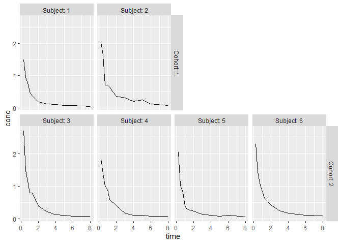
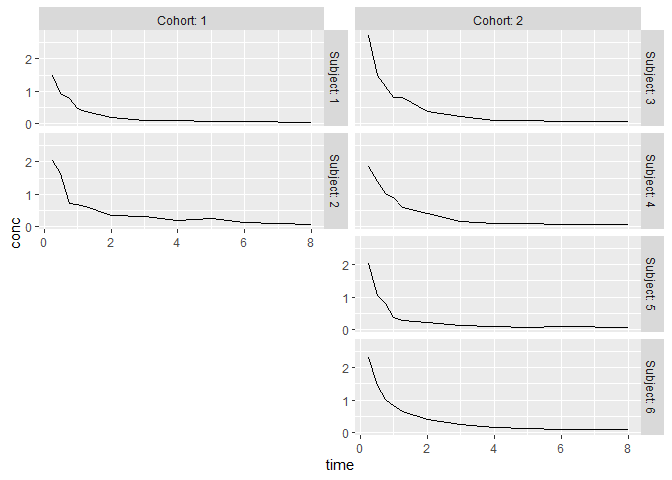

<!-- README.md is generated from README.Rmd. Please edit that file -->

# ggragged <a href="https://mikmart.github.io/ggragged/"></a>

<!-- badges: start -->

[](https://lifecycle.r-lib.org/articles/stages.html#experimental)
[](https://github.com/mikmart/ggragged/actions/workflows/R-CMD-check.yaml)
<!-- badges: end -->

ggragged extends the faceting system in
[ggplot2](https://ggplot2.tidyverse.org/) to ragged grids – a hybrid
layout between `facet_wrap()` and `facet_grid()`.

- `facet_ragged_rows()` groups panels into rows of (potentially) varying
  lengths.
- `facet_ragged_cols()` groups panels into columns of (potentially)
  varying lengths.

## Installation

You can install the development version of ggragged like so:

``` r
remotes::install_github("mikmart/ggragged")
```

## Example

Ragged grids can be used to clearly separate nested hierarchies in the
panel layout:

``` r
library(ggplot2)
library(ggragged)

p <- ggplot(Indometh, aes(time, conc)) + geom_line()

# Panels for each subject, with cohorts on separate rows
p + facet_ragged_rows(
 vars(Cohort = 1 + Subject %in% 3:6),
 vars(Subject = as.character(Subject)),
 labeller = label_both
)
```



``` r
# Panels for each subject, with cohorts in separate columns
p + facet_ragged_cols(
 vars(Subject = as.character(Subject)),
 vars(Cohort = 1 + Subject %in% 3:6),
 labeller = label_both
)
```


